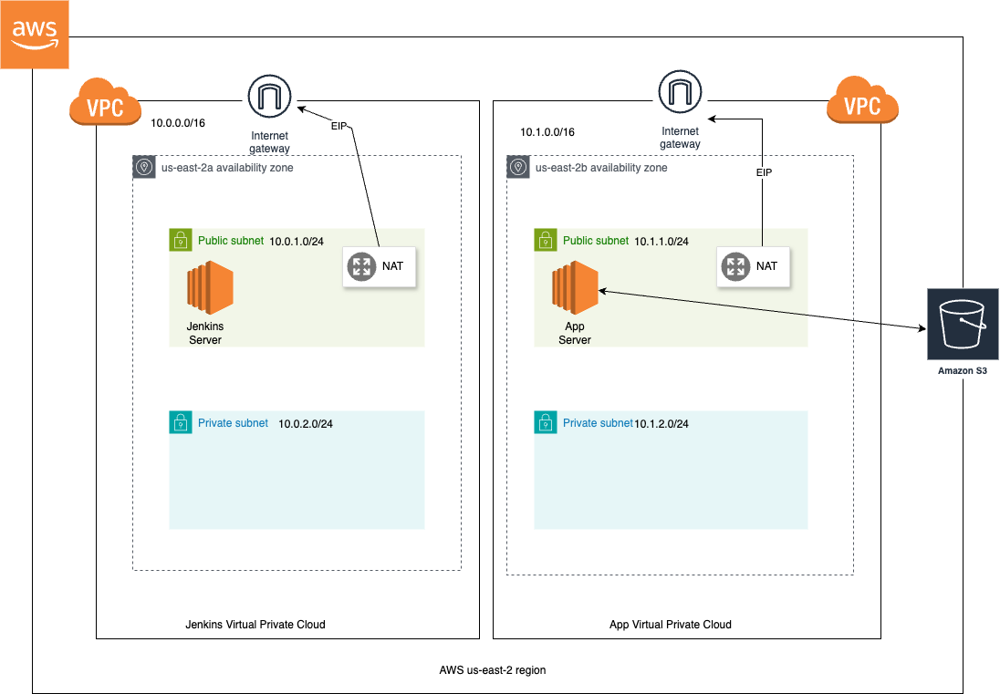

# DevOps Course Final Project

## Project Tech Stack
- Github, Dockerhub
- AWS: EC2, S3, CloudWatch
- Terraform
- Ansible
- Jenkins
- Express.js
- PostgresQL

## Steps to start the project

- In [/terraform-jenkins](./terraform-jenkins) directory: generate ec2_key keypair, run `terraform init`, `terraform apply`
- In [/ansible](./ansible) directory create all the needed credentials files described in the [README](./ansible/README.md), run `ansible-playbook jenkins-playbook.yml  -i  inventory.ini  --extra-vars "ansible_host=$(<../terraform-jenkins/jenkins_ip.txt )"  --diff --private-key=../terraform-jenkins/ec2_key`
- Go to the generated API address: and log in to Jenkins dashboard
- Start `terraform` pipeline
- To configure GitHub webhook: grab the generated app server IP and go to 'Manage Webhook' page, and paste 'paload URL' in the format `http://{SERVER_IP}:${PORT}/github-webhook/`. This webhook will be triggering `Docker` pipeline on push
- After first trial jobs, Jenkins will be able to run `Ansible` pipeline after `Terraform`, and `Application` - after `Ansible`
- Logs will be accessible in AWS CloudWatch Log Group